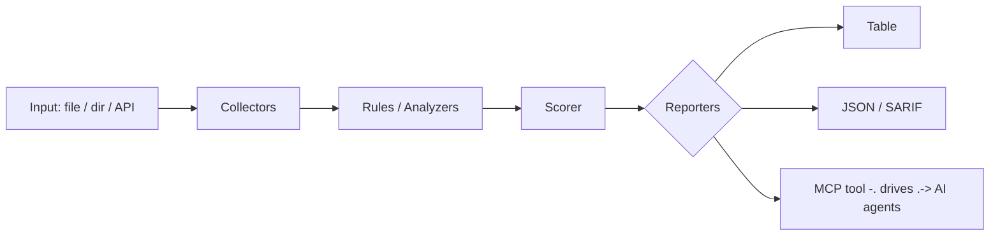

<a name="top"></a>
<div align="center">


# SEMSIFT

### Lightweight semantic-aware SAST that runs curated taint rules over diffs only, so PRs get fast incremental SAST instead of whole-repo scan fatigue.


[](#install--every-way-every-platform) [](https://github.com/cognis-digital/semsift/actions) [](LICENSE) [](https://github.com/cognis-digital)

*Application & Mobile Security — SAST/DAST-lite and binary triage.*

</div>

```bash
pip install "git+https://github.com/cognis-digital/semsift.git"
semsift scan .            # → prioritized findings in seconds
```

<!-- cognis:layman:start -->
## What is this?

semsift is a security scanner for developers that checks only the new code you are adding — not your entire project — so it catches potential security problems in your pull requests without overwhelming you with thousands of existing alerts. When you run it on a code change, it looks for common vulnerabilities like hardcoded passwords, SQL injection risks, and unsafe command execution, then tells you exactly which line is the problem and why. It outputs results as a readable table or as machine-readable JSON, and can automatically fail a CI build if serious issues are found. It is built for software teams who want fast, focused security feedback on every change they ship.
<!-- cognis:layman:end -->

## Contents

- [Why semsift?](#why) · [Features](#features) · [Quick start](#quick-start) · [Example](#example) · [Architecture](#architecture) · [AI stack](#ai-stack) · [How it compares](#how-it-compares) · [Integrations](#integrations) · [Install anywhere](#install-anywhere) · [Related](#related) · [Contributing](#contributing)

<a name="why"></a>
## Why semsift?

Semgrep full scans are noisy and slow on big repos; semsift scans only changed code paths + their reachable sinks, killing alert fatigue — the #1 reason teams abandon SAST.

`semsift` is single-purpose, scriptable, and self-hostable: point it at a target, get prioritized results in the format your workflow already speaks (table · JSON · SARIF), gate CI on it, and let agents drive it over MCP.

<div align="right"><a href="#top">↑ back to top</a></div>

<a name="features"></a>
## Features

- ✅ Parse Unified Diff
- ✅ Scan Added Lines
- ✅ Scan Diff Text
- ✅ Findings To Dicts
- ✅ Runs on Linux/macOS/Windows · Docker · devcontainer
- ✅ Ports in Python, JavaScript, Go, and Rust (`ports/`)

<div align="right"><a href="#top">↑ back to top</a></div>

<a name="quick-start"></a>
<!-- cognis:domains:start -->
## Domains

**Primary domain:** AI & ML  ·  **JTF MERIDIAN division:** ATHENA-PRIME · SAGE

**Topics:** `cognis` `ai` `llm` `machine-learning`

Part of the **Cognis Neural Suite** — 300+ source-available tools organized across 12 domains under the JTF MERIDIAN command structure. See the [suite on GitHub](https://github.com/cognis-digital) and [jtf-meridian](https://github.com/cognis-digital/jtf-meridian) for how the pieces fit together.
<!-- cognis:domains:end -->

<!-- cognis:install:start -->
## Install

`semsift` is source-available (not published to PyPI) — every method below installs
straight from GitHub. Pick whichever you prefer; the one-line scripts auto-detect
the best tool available on your machine.

**One-liner (Linux / macOS):**
```sh
curl -fsSL https://raw.githubusercontent.com/cognis-digital/semsift/HEAD/install.sh | sh
```

**One-liner (Windows PowerShell):**
```powershell
irm https://raw.githubusercontent.com/cognis-digital/semsift/HEAD/install.ps1 | iex
```

**Or install manually — any one of:**
```sh
pipx install "git+https://github.com/cognis-digital/semsift.git"     # isolated (recommended)
uv tool install "git+https://github.com/cognis-digital/semsift.git"  # uv
pip install "git+https://github.com/cognis-digital/semsift.git"      # pip
```

**From source:**
```sh
git clone https://github.com/cognis-digital/semsift.git
cd semsift && pip install .
```

Then run:
```sh
semsift --help
```
<!-- cognis:install:end -->

## Quick start

```bash
pip install "git+https://github.com/cognis-digital/semsift.git"
semsift --version
semsift scan .                       # scan current project
semsift scan . --format json         # machine-readable
semsift scan . --fail-on high        # CI gate (non-zero exit)
```

<div align="right"><a href="#top">↑ back to top</a></div>

<a name="example"></a>
## Example

```text
$ semsift scan .
  [HIGH    ] SEM-001  example finding             (./src/app.py)
  [MEDIUM  ] SEM-002  another signal              (./config.yaml)

  2 findings · risk score 5 · 38ms
```

<div align="right"><a href="#top">↑ back to top</a></div>

<a name="architecture"></a>
## Architecture



<div align="right"><a href="#top">↑ back to top</a></div>

<a name="ai-stack"></a>
## Use it from any AI stack

`semsift` is interoperable with every popular way of using AI:

- **MCP server** — `semsift mcp` (Claude Desktop, Cursor, Cognis.Studio, [uncensored-fleet](https://github.com/cognis-digital/uncensored-fleet))
- **OpenAI-compatible / JSON** — pipe `semsift scan . --format json` into any agent or LLM
- **LangChain · CrewAI · AutoGen · LlamaIndex** — wrap the CLI/JSON as a tool in one line
- **CI / scripts** — exit codes + SARIF for non-AI pipelines

<div align="right"><a href="#top">↑ back to top</a></div>

<a name="how-it-compares"></a>
## How it compares

| | **Cognis semsift** | Semgrep, with the differential-scan ergonomics of git-diff tooling |
|---|:---:|:---:|
| Self-hostable, no account | ✅ | varies |
| Single command, zero config | ✅ | ⚠️ |
| JSON + SARIF for CI | ✅ | varies |
| MCP-native (AI agents) | ✅ | ❌ |
| Polyglot ports (JS/Go/Rust) | ✅ | ❌ |
| Open license | ✅ COCL | varies |

*Built in the spirit of **Semgrep, with the differential-scan ergonomics of git-diff tooling**, re-framed the Cognis way. Missing a credit? Open a PR.*

<div align="right"><a href="#top">↑ back to top</a></div>

<a name="integrations"></a>
## Integrations

Pipes into your stack: **SARIF** for code-scanning, **JSON** for anything, an **MCP server** (`semsift mcp`) for AI agents, and a webhook forwarder for SIEM/Slack/Jira. See [`docs/INTEGRATIONS.md`](docs/INTEGRATIONS.md).

<div align="right"><a href="#top">↑ back to top</a></div>

<a name="install-anywhere"></a>
## Install — every way, every platform

```bash
pip install "git+https://github.com/cognis-digital/semsift.git"    # pip (works today)
pipx install "git+https://github.com/cognis-digital/semsift.git"   # isolated CLI
uv tool install "git+https://github.com/cognis-digital/semsift.git" # uv
pip install cognis-semsift                                          # PyPI (when published)
docker run --rm ghcr.io/cognis-digital/semsift:latest --help        # Docker
brew install cognis-digital/tap/semsift                             # Homebrew tap
curl -fsSL https://raw.githubusercontent.com/cognis-digital/semsift/main/install.sh | sh
```

| Linux | macOS | Windows | Docker | Cloud |
|---|---|---|---|---|
| `scripts/setup-linux.sh` | `scripts/setup-macos.sh` | `scripts/setup-windows.ps1` | `docker run ghcr.io/cognis-digital/semsift` | [DEPLOY.md](docs/DEPLOY.md) (AWS/Azure/GCP/k8s) |

<div align="right"><a href="#top">↑ back to top</a></div>

<a name="related"></a>
<a name="verification"></a>
## Verification

[](AUDIT.md)

Every push is verified end-to-end. Latest audit (2026-06-13):

```text
tests        : 13 passed, 0 failed, 0 errored
compile      : all modules parse
cli          : C:\Python314\python.exe: No module named https
package      : https
```

<details><summary>CLI surface (<code>--help</code>)</summary>

```text
C:\Python314\python.exe: No module named https
```
</details>

Full machine-readable results: [`AUDIT.md`](AUDIT.md) · regenerate with `python -m https --help` + `pytest -q`.

<div align="right"><a href="#top">↑ back to top</a></div>


## Related Cognis tools

- [`apkpeek`](https://github.com/cognis-digital/apkpeek) — One-command static triage of Android APK/AAB binaries: surfaces hardcoded secrets, exported components, dangerous permissions, and insecure manifest flags as a single SARIF report.
- [`ipasnitch`](https://github.com/cognis-digital/ipasnitch) — Static scanner for iOS .ipa bundles that flags ATS exceptions, missing entitlements hardening, embedded URLs/secrets, and weak Info.plist transport settings.
- [`hookcraft`](https://github.com/cognis-digital/hookcraft) — Generates ready-to-run Frida instrumentation scripts from a YAML intent (e.g. 'bypass SSL pinning', 'dump crypto keys') and verifies they attach to a target process.
- [`dastlite`](https://github.com/cognis-digital/dastlite) — A headless, config-as-code DAST runner that crawls an authenticated web/mobile-API surface and fires a curated active-scan ruleset, emitting deduplicated SARIF.
- [`cheatsense`](https://github.com/cognis-digital/cheatsense) — Anti-cheat telemetry analyzer that ingests game session logs and flags statistically anomalous input/aim/movement signatures with explainable per-flag scoring.
- [`binhunt`](https://github.com/cognis-digital/binhunt) — Game/desktop binary integrity scanner that fingerprints executables, detects common packers/obfuscators, and diffs against a known-good baseline to catch tampering.

**Explore the suite →** [🗂️ all 170+ tools](https://github.com/cognis-digital/cognis-neural-suite) · [⭐ awesome-cognis](https://github.com/cognis-digital/awesome-cognis) · [🔗 cognis-sources](https://github.com/cognis-digital/cognis-sources) · [🤖 uncensored-fleet](https://github.com/cognis-digital/uncensored-fleet) · [🧠 engram](https://github.com/cognis-digital/engram)

<div align="right"><a href="#top">↑ back to top</a></div>

<a name="contributing"></a>
## Contributing

PRs, new rules, and demo scenarios are welcome under the collaboration-pull model — see [CONTRIBUTING.md](CONTRIBUTING.md) and [SECURITY.md](SECURITY.md).

> ### ⭐ If `semsift` saved you time, **star it** — it genuinely helps others find it.

## License

Source-available under the **Cognis Open Collaboration License (COCL) v1.0** — free for personal, internal-evaluation, research, and educational use; **commercial / production use requires a license** (licensing@cognis.digital). See [LICENSE](LICENSE).

---

<div align="center"><sub><b><a href="https://cognis.digital">Cognis Digital</a></b> · one of 170+ tools in the <a href="https://github.com/cognis-digital/cognis-neural-suite">Cognis Neural Suite</a> · <i>Making Tomorrow Better Today</i></sub></div>
